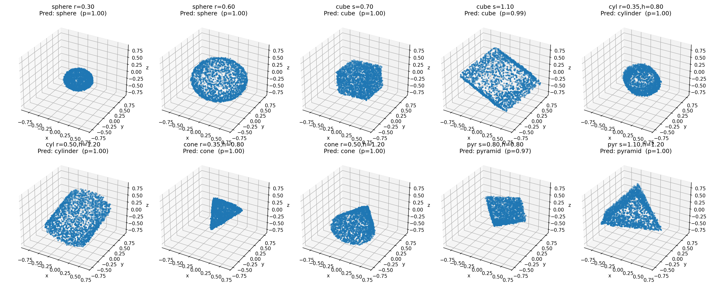

# Sparse Shape Classifier (spconv)

Classifies 3D shapes (sphere, cube, cylinder, cone, pyramid) from point clouds using sparse 3D convolutions.

## Pipeline
1. **Sample Points**  
   Generate noisy surface point clouds for 5 shapes with optional rotation + dropout.
2. **Voxelize**  
   Normalize points to a 3D grid → unique occupied voxels.
3. **Sparse Dataset + Loader**  
   Convert to `SparseConvTensor` batches (features = occupancy).
4. **Model**  
   `spconv` sparse CNN → dense → global avg pool → linear classifier.
5. **Training**  
   Cross-entropy + AdamW; save best checkpoint.
6. **Demo**  
   10 test cases (2 per shape) → predict → print table → 2×5 3D plot with predictions + confidence.

## CLI Args
`--grid`, `--points`, `--epochs`, `--lr`, `--noise`, `--dropout`,  
`--rot_aug/--no_rot_aug`, `--quick`, `--workers`.

## Outputs
- Best model: **`best_sparse_shape_cls.pt`**  
- Visualization: **`demo_grid.png`**

## Third-Party Packages
Special thanks to the open-source projects that make this possible:

- **PyTorch** — core deep learning framework  
- **spconv** — efficient sparse 3D convolution ops  
- **NumPy** — numerical computing utilities  
- **matplotlib** — 3D plotting and visualization  

